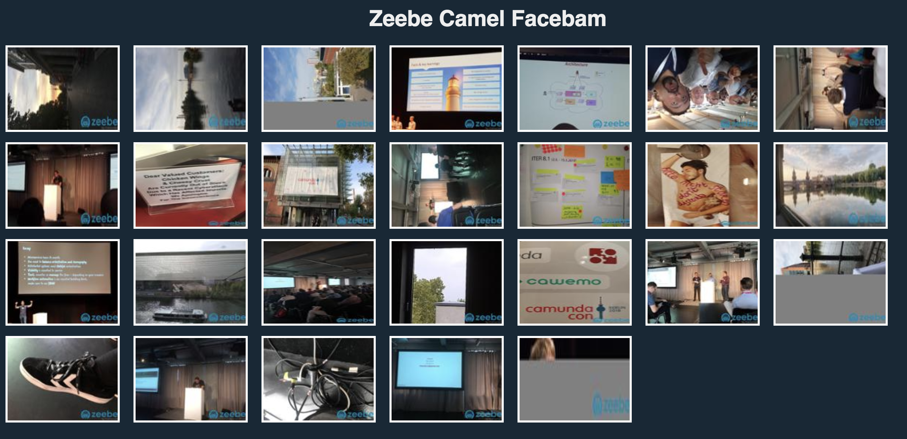
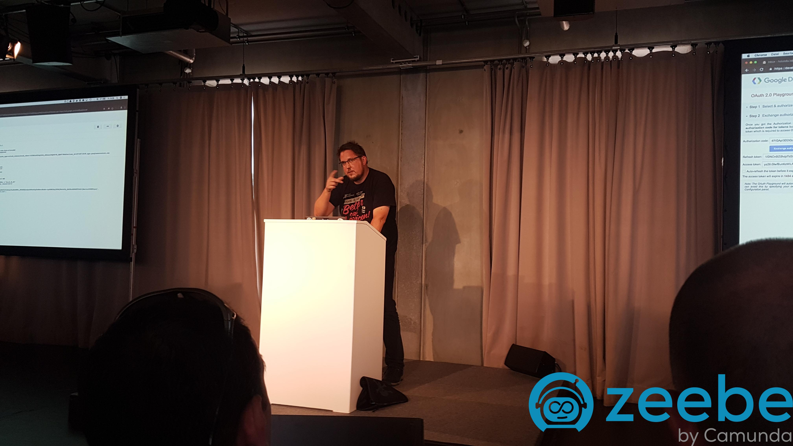

# camel facebam

Take the [zb-facebam](https://github.com/zeebe-io/zb-facebam) example to the next level using SpringBoot and Apache camel

Example setup using zeebe with spring boot and apache camel in "the cloud".

## The Story

4 Players:

- the client, sitting outside the cloud, not knowing about the infrastructure
- the broker/zeebeclient bundle that runs the process and orchestrates the workers ... 
- worker a - watermarker - registeres at broker and wants to add watermarks to a given image
- worker b - thumbnailer - registers at broker and wants to create thumbnails from given image

### The Client

The client just wants to 

* run an app that does not depend on zeebe at all
* camel reads from source folder and writes to destination 

### The Broker (+ZeebeClient)

* spring boot application running zeebe broker and client on one node
* listens to input directory via camel

### The Watermarker

* registers at broker via camel
* observes input dir via camel
* receives image from input dir
* adds watermark
* writes image to output dir

### The Thumbnailer

* registers at broker via camel
* observes input dir via camel
* receives image from input dir
* adds watermark
* writes image to output dir

# The cloud

This is the cloud. Referred to hereafter as "the cloud".

Its three systems loosely coupled via camel routes.
They could run independent in docker containers, but docker is so 2017, so we have 
them as pure old fashioned system jobs with exchange through file-io.

## Components

* The Broker - keeping everything together
* The Watermarker - keen to put stamps on every image
* The Thumbnailer - shrink, shrink

